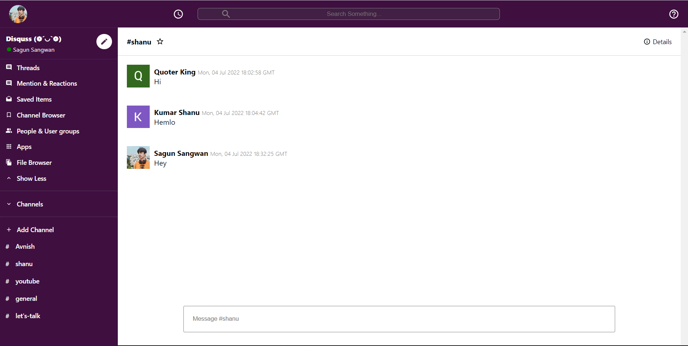

# Getting Started with Create React App

This project was bootstrapped with [Create React App](https://github.com/facebook/create-react-app).

 ## Check it out [Slack-Clone]!
 

## Overview 👀

- Slack-clone is single page webapp where its user can choose diffrent chatroom for chatting
- This project uses firebase's firestore as a backend service for storing and retreving chats all in real time
- User can create new chatrooms / channels for chatting

## WIP 🛠
- Custom user chatroom
- Authentication using firebaseAuth
- Mobile APP

## How To Contribute🤝 
- Yes,it is open source you can clone and change code to your need.
- Most of the code is self explanatory, anyhow
- for any clarification on code or want to contribute contact 
- [Gmail] / [Instagram] /[LinkedIn]

[Gmail]: <mailto:coolshagun.sangwan15@gmail.com>
[LinkedIn]: <https://www.linkedin.com/in/sagun-sangwan-9662401b2/>
[Instagram]: <https://www.instagram.com/_sangwan_shagun/>
[Slack-Clone]: <https://slack-clone-89f50.web.app>
